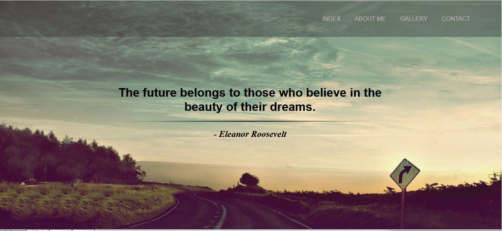

**********************************************************************
		DC
		
	Author: Emilija Zdilar
	Version: 1.0.0
	Date: 14.07.2017.

	DC is a quote themed responsive website with a couple of articles,
	basic information about me, the contact form, and the gallery. The
	main purpose of the DC was to learn the fundamentals of responsive 
	design without the aid of a framework. 
	I consider it to be an accurate portrayal of my personal aesthetic
	tastes in design.
	 		
**********************************************************************

Getting Started:

- Visit http://zdilaremilija.epizy.com/
**********************************************************************

 Example: 
  

**********************************************************************

Acknowledgments:

- Responsive Web Design Fundamentals
  by Pete LePage and Cameron Pittman

**********************************************************************
